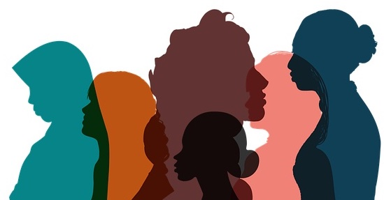

{width=350px}

# ILOs for this week

- Describe subtypes of depression
- Are we pathologising normal sadness (grief)
- Epidemiology (genetic epi?)
- Clinical assessments of depression
- Courses and consequences of depression
- Causes + diathesis stress
- Inflammation and immune system
- Parenting and depression
- Differences in male and female experiences of depression

