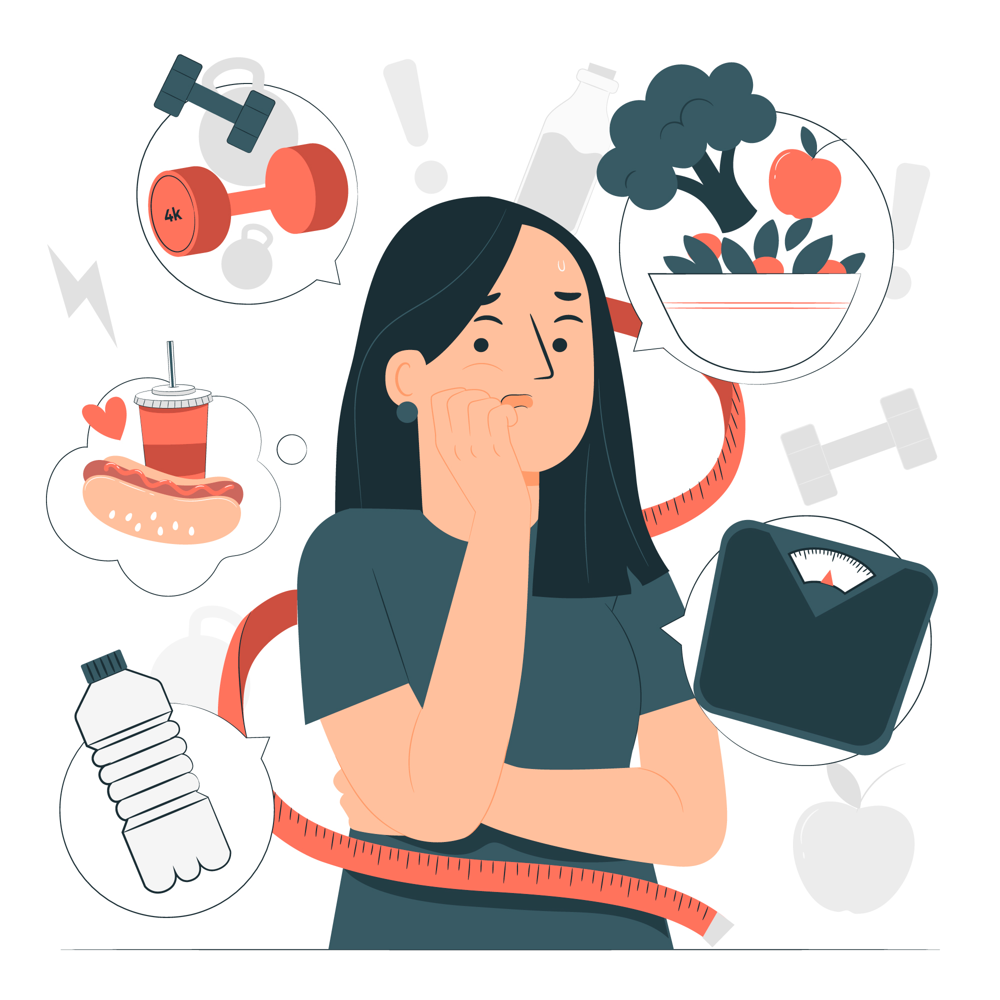

{width=350px}

<a href="https://www.freepik.com/free-vector/eating-disorder-concept-illustration_21118412.htm#query=eating%20disorders&position=0&from_view=keyword">Image by storyset</a> on Freepik

# ILOs for this week

- Different types
- Epidemiology
- Consequences
- Treatments
- Social policy and treatments (respecting autonomy of client)
