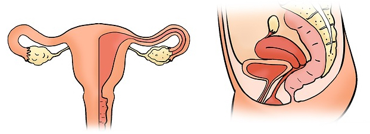

# ILOs for this week

At the end of this week, students should be able to...

- Compare females and males in terms of genetics, anatomy hormones, brain structure/function, and fetal development.
- Describe the physiology of the menstrual cycle.
- Explain the physiological changes that occur at key reproductive life stages: puberty, pregnancy, breastfeeding, and menopause.

# What you need to do this week

- **Before** coming to the seminars, please make sure you have read/watched/listened to all the readings, videos and audio recordings below.
- **During** the seminars, please:
    + Make the most out of your time by contributing to the discussions and listening to others.
    + Three to four people will be responsible for making notes each week. Please check the [rota](https://www.dropbox.com/s/w92ab1ntub6mytx/PSYM3430%20Note%20taking%20rota.docx?dl=0) to find out if it's your week.
    + This week there is a group task, which will be explained during the seminar.
-**After** the seminars, if you are a note-taker, please check the notes and make any additions or tidy them up if necessary. All class members should then check the notes and make any additions. Note-takers should also add *revision questions* to the *revision quiz*.  

# Sexual dimorphism

## Genetics

## Anatomy

### The female reproductive system

<html>
<audio controls>
  <source src="https://www.dropbox.com/s/nd0y67l01z2g7m0/podcast_28days_day1_power.mp3?dl=1" type="audio/mp3">
</audio></html>

### Brain

<iframe width="560" height="315" src="https://www.youtube.com/embed/z5c7ubF0u-U" title="YouTube video player" frameborder="0" allow="accelerometer; autoplay; clipboard-write; encrypted-media; gyroscope; picture-in-picture" allowfullscreen></iframe>

https://academic.oup.com/cercor/article/28/8/2959/4996558

## Endocrinology

## Fetal development

# The menstrual cycle

# GROUP TASK: Physiological changes at reproductive stages

Groups to research physiological changes at one stage and then present back to class (1hr?)

## Puberty

## Pregnancy and breastfeeding

## Menopause
