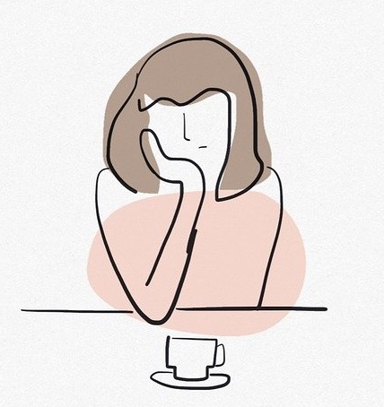

{height=400px}

# ILOs for this week

- Critically discuss ideas around gender and sex differences in personality and psychology
- Critically discuss ideas around gender and sex differences in ways of thinking and rumination

https://en.wikipedia.org/wiki/Sex_differences_in_humans#Physiology

# Sex/gender differences in personality

# Sex/gender differences in ways of thinking

Women and emotion
