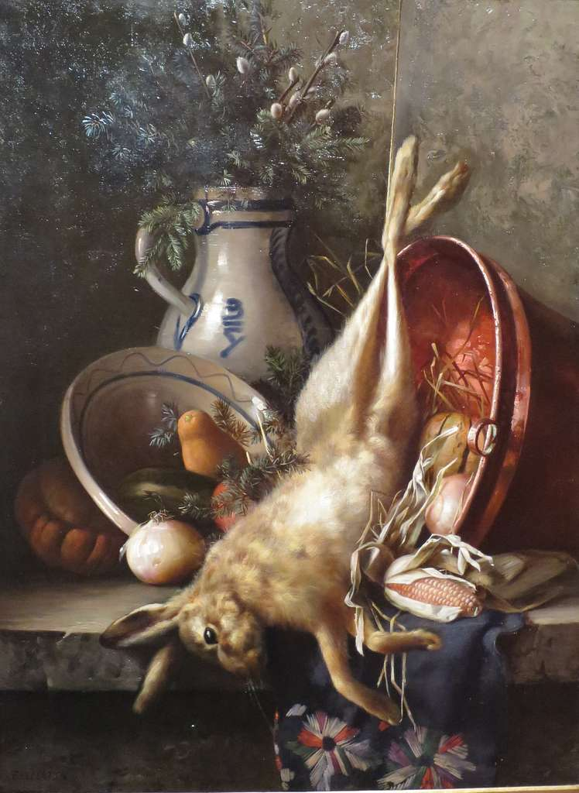

{width=350px}

# ILOs for this week

- Discuss the social and cultural roles and experiences of women
- Discuss the gender health gap
- Consider policies and laws that disproportionately affect women

# Social and cultural roles of women

stigma

## The patriarchy and misogyny

## Violence against women

## Interpersonal/family/attachment relationships

# The gender health gap

# Policies and laws
