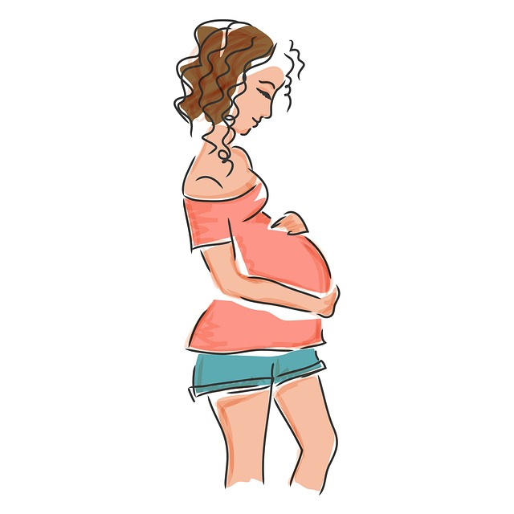

{width=350px}

# ILOs for this week

- Explain what post- and ante-natal depression, perinatal anxiety and OCD, PTSD and birth trauma, and postpartum psychosis are and how they are diagnosed and managed.
- Discuss theories around the aetiology of perinatal mental health disorders, including the role of reproductive hormones.
- Discuss the impact of pregnancy loss on mental health.
- Describe how early experiences of motherhood, including experiences of breastfeeding, might impact mental health.

# Hormonal fluctuations throughout pregnancy

# Perinatal mental health disorders

## Post- and ante-natal depression

## Perinatal anxiety and OCD

## PTSD and birth trauma

## Post-partum psychosis

# Pregnancy loss and mental health

# Early motherhood and mental health

## Breastfeeding