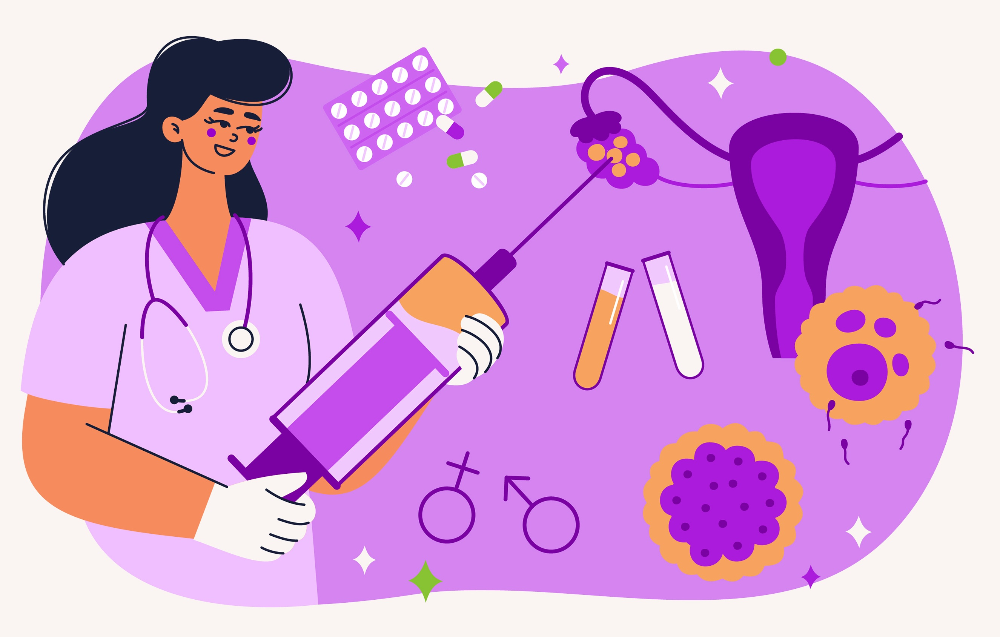

<a href="https://www.dropbox.com/s/zm2dm3bzbz28ho1/W8.docx?dl=1" class="button">Download editable version</a>

{width=350px}

Image by <a href="https://www.freepik.com/free-vector/hand-drawn-flat-design-ivf-illustration_27596558.htm#query=ivf&position=33&from_view=keyword">Freepik</a>

ESSAY WAS DUE YESTERDAY, TODAY'S SESSION IN A DIFFERENT ROOM, GIVE LESS PRE-WORK THAN USUAL AND MAKE SESSION A BIT MORE CHILLED

# ILOs for this week

- Discuss factors affecting an individual woman's status as child-free, childless, or a mother
- Discuss the potential impact of a woman's reproductive history/intentions on her mental health
- Discuss the impact of infertility on mental health
- Discuss the impact of fertility treatments on mental health

# Reproductive/motherhood status

https://www.channel4.com/programmes/kathy-burkes-all-woman/on-demand/68015-003

## Association with mental health

# Infertility and mental health

# Fertility treatments and mental health