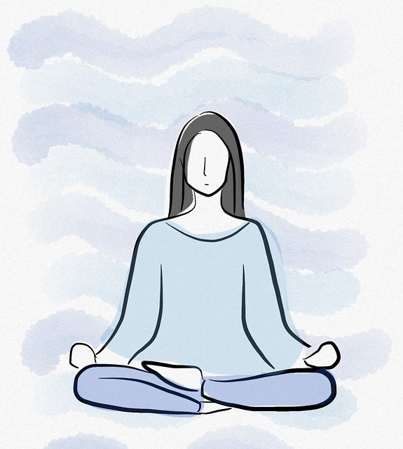

<a href="https://www.dropbox.com/s/5n7cqdm4s0gpzlg/W9.docx?dl=1" class="button">Download editable version</a>

{width=350px}

# ILOs for this week

- Sex-disaggregated ratios
- Why sex differences? Artifacts + biopsychosocial factors
- Assessment and treatment of psychiatric disorders in women

Lancet Psychiatry series on women's mental health (some of these have been covered elsewhere in this course, but you may wish to re-read them before this session)

Anita Riecher-Rössler Oestrogens, prolactin, hypothalamic-pituitary-gonadal axis, and schizophrenic psychoses

Sophie H Li, Bronwyn M Graham Why are women so vulnerable to anxiety, trauma-related and stress-related disorders? The potential role of sex hormones

Christine Kuehner Why is depression more common among women than among men?

Sian Oram, Hind Khalifeh, Louise M Howard Violence against women and mental health

